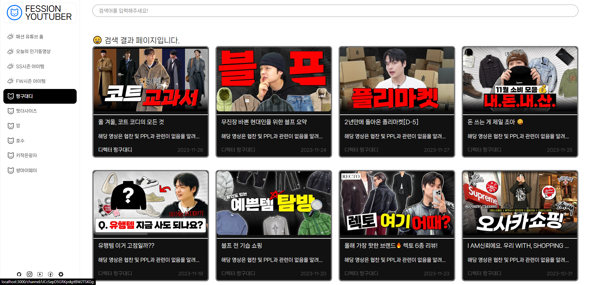

# 나만의 패션 유튜브 사이트 만들기

-   rapidApi에서 유튜브 api를 가져와 패션 유튜브 사이트를 만들었습니다.

## 사용한 라이브러리, api

# SWIPER JS 사용
- 모바일 터치 슬라이더 라이브러리로, 여러 개의 슬라이드를 좌우로 스와이프하여 이동할 수 있게 해줍니다.
- swiper js를 사용해 슬라이드 기능을 쉽게 구현할 수 있었습니다. 
# 유튜브 API 사용
- 유튜브 API를 사용하면 웹페이지에 직접 유튜브의 비디오, 재생목록, 채널 등을 삽입하거나 관리할 수 있습니다.
- 사용자가 사이트를 이탈하지 않고도 유튜브 콘텐츠를 볼 수 있게 해줍니다.
- 엔드 포인트를 활용해 원하는 정보만 불러오는 과정이 재미있었습니다..

  
# 리액트 서스펜스
- 데이터의 로딩 상태를 더 우아하게 다루는 새로운 기능입니다. 
- 데이터가 준비될 때까지 컴포넌트 렌더링을 '일시 중지'할 수 있으며, 이는 사용자에게 데이터 로딩 시간 동안 적절한 UI를 보여주는데 유용합니다.
- 
# 리덕스
- 리덕스는 애플리케이션의 상태를 관리하는 데 사용되는 자바스크립트 라이브러리입니다. 
이를 사용하면 애플리케이션의 상태를 예측 가능하고 일관된 방식으로 관리할 수 있습니다. 
이는 복잡한 사용자 인터페이스와 API 호출을 다루는 대규모 웹 애플리케이션에서 특히 유용합니다.
- props를 사용해 값을 전달하려는 과정에서 부모 자식의 관계가 아닌 컴포넌트에서는 props가 불가하여 redux를 사용해보았습니다.

# 포스트맨 사용
-   API 테스트를 위해 사용했습니다. API 요청을 만들고 테스트하고 API를 쉽게 관리하는데 용이했습니다.

# 설치

1.  axios

-   Axios는 Promise 기반의 HTTP 클라이언트로, 브라우저와 Node.js 모두에서 사용할 수 있습니다. GET, POST 등의 HTTP 요청을 쉽게 보낼 수 있게 해주며, 응답을 자동으로 JSON으로 변환해줍니다.

2.  sass

-   CSS 전처리기로, CSS를 프로그래밍 언어처럼 사용할 수 있게 해줍니다. 변수, 함수, 믹스인, 중첩 등의 기능을 제공하여 CSS 코드를 더 쉽게 관리할 수 있게 해줍니다.

3.  swiper

-   

4.  react-icon

-   React에서 사용할 수 있는 아이콘 라이브러리로, Font Awesome, Ionicons, Material Design 등 다양한 아이콘 세트를 제공합니다.

5.  react-player

-   React에서 다양한 종류의 비디오를 재생할 수 있게 해주는 컴포넌트입니다. YouTube, Facebook, Twitch 등 다양한 플랫폼의 비디오 URL을 지원합니다.

6.  react-helmet-async

-   React 앱의 HTML 헤드 태그를 동적으로 관리하게 해주는 라이브러리입니다. 페이지별로 타이틀, 메타 태그 등을 설정할 수 있어 SEO(Search Engine Optimization)에 유용합니다.

7.  react-router-dom

-   라우팅을 관리하는 라이브러리입니다. 다양한 라우팅 구성 요소를 제공하여 URL에 따라 다른 뷰를 보여주고, 브라우저의 히스토리를 관리하는 등의 기능을 제공합니다.

